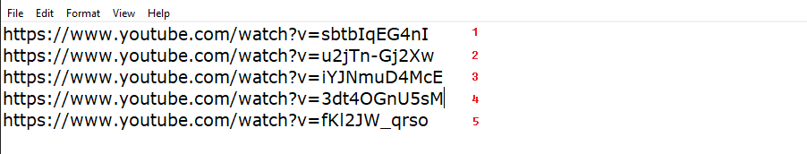
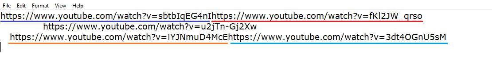

# YouTube-Scraper
---------------------------

This simple program extracts Video likes, dislikes, title(name),
view count and other stuff!

only thing you gotta do is provide it a valid link :D

---------------------------
> Reading links in a TXT file

The program can read links in two diffrent ways:

  1: Clean format
    
  
  
  2: Dirty format
    
  
Since each YT link is 48 characters, there should not be a problem if you put links right after another without starting a new line.
Also ... **Don't put spaces inbetween a link (who would do that anyways xD)

---------------------------

> a TODO list for future updates and enhancements
  - [x] Create a functional simple backend
  - [x] Add GUI (Tkinter)
  - [ ] Save outputs to a CSV file 
  - [x] read links from txt file
  - [x] colored log output
  - [ ] Fix GUI freezing (Using Threading)
 
